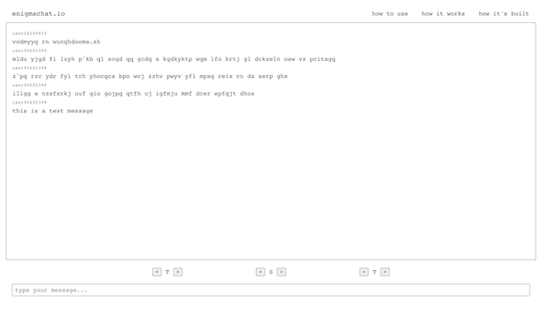

<!--  -->

# ⌨️ [enigmachat.io](https://www.enigmachat.io)

A real-time chat application with a twist.

## ⚡️ Technologies

## 🧠 Concept
[enigmachat.io](https://www.enigmachat.io) takes a unique approach to the traditional chat application. Rather than allowing users to switch between different conversations, [enigmachat.io](https://www.enigmachat.io) provides only one chat room for all users. By itself this implementation wouldn’t be very useful, as users have no assurance of privacy. That’s where the Enigma encryption comes in.

All messages are encrypted and decrypted using an Enigma machine emulator. In order to read messages you’ll need to know the ``rotor settings” (the three letters used to encrypt) used by the author, and in order for someone to read your messages they’ll need to know your rotor settings.

*(Note: Since the three rotors can each individually be one of 26 different letters, there are 17,576 possible rotor settings you can use to encrypt your messages. The complexity of this emulator is far less than that of the original Enigma machine. To learn more about the original Enigma machine, visit [https://brilliant.org/wiki/enigma-machine/](https://brilliant.org/wiki/enigma-machine/).)*

## 🛜 Data Flow
The whole idea of this application is to protect messages. Therefore, plaintext is only ever seen client-side (either to someone with the proper rotor settings or to someone using brute force). Here’s a simple explanation of how messages are processed:

1. A user chooses their rotor settings and their plaintext. They then choose to send their message.
2. The plaintext gets encrypted client-side.
3. The ciphertext is sent in a request to the server.
4. The ciphertext gets stored in the database and becomes available for other users to see.
5. Other users see the ciphertext and, while changing rotor settings, will continue to see further encrypted ciphertext until they choose the rotor settings used by the message’s author. At this point the further encrypted ciphertext becomes plaintext.

Handling all encryption and decryption client-side ensures that all data being transferred is protected by the Enigma encryption. Even if someone were to intercept a request or gain access to the database, they wouldn’t find any plaintext.

## 📷 Images

